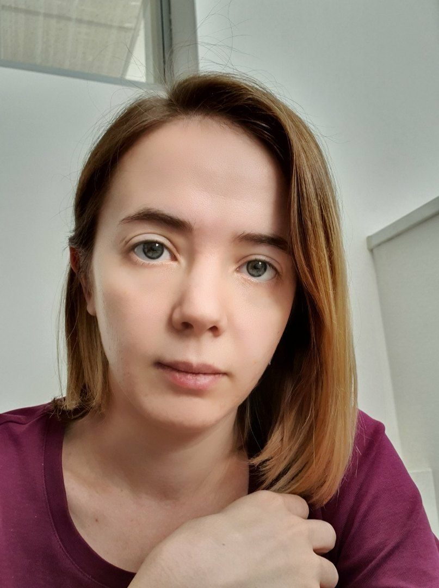

# Anna Perevedentseva 



## Contact information

**Email:** anna.pereved@gmail.com  
**Telegram:** @binary_apple  
**GitHub:** [binary-apple](https://github.com/binary-apple)  
**Discord:** Nia (@binary-apple)

## About 
Ex-insurance analyst switching into frontend development.

## Experience
SAO "RESO-Garantia"  
Actuary  
Jul 2015 - Aug 2020, 5 years 2 months  

## Skills & Projects
- PL/SQL
- R
- HTML
- CSS
- JavaScript

### Code example
```
function multiply(a, b){
  return a * b
}
```
### Completed projects
[CV](https://github.com/binary-apple/rsschool-cv)

## Education
- **Lomonosov Moscow State University (MSU)**  
Specialist, Mathematical Cybernetics  
2010-2015
- **RS School**  
JavaScript/Frontend course  
2022q3, in progress
## Languages
- **Russian** - native speaker
- **English** - upper-intermediate
- **German** - intermediate

